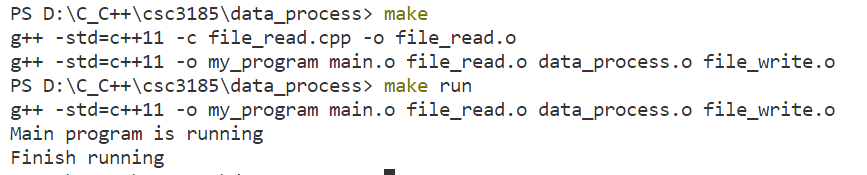

run: 
data_process 目录下
    方法1： 
        运行my_program
    方法2：
        make 
        make run
    

数据输入：图片数据的输出文件放在上级目录（即和data_process相同目录）的data文件内，命名为input.txt
    格式是：速度 距离1 距离2 距离3
    如果需要更改路径、路径名称，参考../data_process/file_read.cpp

数据输出：输出在和input.txt同目录的文本文件 output.txt
    格式是
        警告（要撞了、安全）
        实际距离：x
        刹车最短距离： y

注意事项：
    目录里不能有中文！
    （待添加）
    
    
